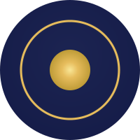
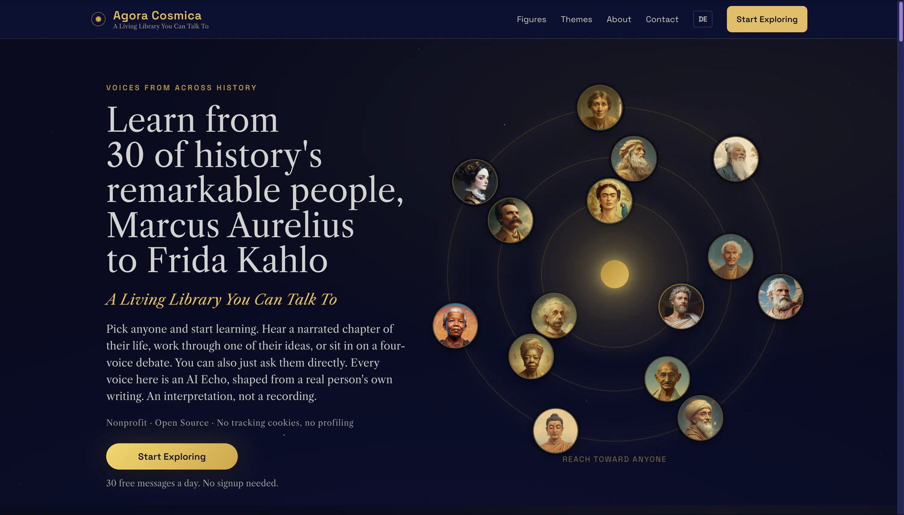
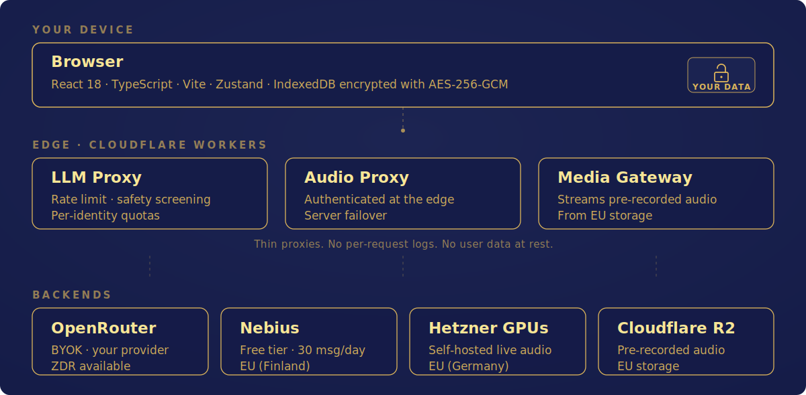

<p align="center">
  
</p>

<h1 align="center">Agora Cosmica</h1>

<p align="center">
  <strong>A Living Library You Can Talk To</strong><br/>
  <sub>Nonprofit · Open Source · No tracking cookies, no profiling</sub>
</p>

<p align="center">
  <a href="LICENSE"></a>
  <a href="#"></a>
  <a href="docs/ACCESSIBILITY.md"></a>
  <a href="docs/COMPLIANCE.md"></a>
  <a href="https://securityheaders.com/?q=https%3A%2F%2Fagoracosmica.org&followRedirects=on"></a>
  <a href="docs/SELF-HOSTING.md"></a>
</p>

<p align="center">
  <a href="https://agoracosmica.org">Live App</a> ·
  <a href="#quick-start">Quick Start</a> ·
  <a href="#architecture">Architecture</a> ·
  <a href="CONTRIBUTING.md">Contribute</a> ·
  <a href="CHANGELOG.md">Changelog</a>
</p>

<p align="center">
  <sub>⭐ If you find this interesting, a star is the simplest way to help us reach more people.</sub>
</p>

---

Agora Cosmica is a Living Library for wisdom from history. Learn from thirty figures, from Marcus Aurelius to Ada Lovelace, Rumi to Frida Kahlo, each with their own researched voice and twelve wisdom teachings. The platform pairs hundreds of pre-recorded narrative episodes and multi-figure dialogues with live AI conversation. Live speech (text-to-speech and speech-to-text) runs on our own GPU servers in Germany. [See all 30 figures →](https://agoracosmica.org/figures)

30 free messages a day, no signup required. Bilingual English and German. On the path to community-driven development: anyone can vote on what gets added next, right inside the app.

<p align="center">
  <strong>Try it, no signup: <a href="https://agoracosmica.org">agoracosmica.org</a></strong>
</p>

<p align="center">
  <a href="https://agoracosmica.org"></a>
</p>

<p align="center">
  <sub>🔊 <strong>Hear the self-hosted Echo voices</strong> (AI Echoes, about 10 seconds each)</sub><br/>
  <sub>German, Qwen3-TTS: <a href=".github/assets/audio/echo-nietzsche-de.mp3">Nietzsche (Solaris)</a> · <a href=".github/assets/audio/echo-hildegard-de.mp3">Hildegard von Bingen (Lyra)</a></sub><br/>
  <sub>English, Kokoro: <a href=".github/assets/audio/echo-shakespeare-en.mp3">Shakespeare (Orion blend)</a> · <a href=".github/assets/audio/echo-lovelace-en.mp3">Ada Lovelace (Stella)</a></sub>
</p>

---

## How it works

Each interaction in Agora Cosmica orbits one figure. The four educational chapters (Story, Wisdom, Prism, Quest) form a learning arc informed by education research (Kolb's experiential cycle, Bloom's taxonomy, retrieval practice): receive, explore, connect, prove. Each chapter prepares the next. Free Talk and Council sit alongside as open-ended formats.

**[Take a tour →](docs/TOUR.md)**

---

## Features

**Content**
- **Six ways to engage**: 4 educational chapters (Story, Wisdom, Prism, Quest) plus Free Talk and Council. [How they work](docs/CHAPTERS.md)
- **Crafted catalog**: 360 stories, 360 prism dialogues, 110 four-figure council debates (55 questions, two depth levels each), all with time-synced audio.
- **30 figures · 12 teachings each**: 360 wisdom teachings spanning 2,500 years of human thought. [Browse the figures](https://agoracosmica.org/figures)
- **Fully bilingual**: English and German across all content, UI, and audio.

**Honest by design**
- **Echo framing**: every figure is presented as an AI Echo (an AI-rendered portrayal), never claimed to be a real recording or to speak for the actual person.
- **Factcheck transparency**: each figure has a per-figure factcheck listing what's historically verified versus what's recreated for narrative.
- **Open source under AGPL-3.0**: the privacy and architecture claims are verifiable by reading the code.
- **Built on learning science**: the 4-chapter arc is informed by Kolb's experiential cycle, Bloom's taxonomy, and retrieval practice.

**Privacy by design**
- **BYOK encryption**: bring your own OpenRouter key, encrypted locally with AES-256-GCM, never stored on our servers.
- **Free tier without signup**: 30 messages a day via our Cloudflare Worker, no account required.
- **No behavioral tracking**: no tracking cookies, no third-party analytics, no per-request access logs of our own, no IP retention in analytics, no cross-session profiles. We do collect anonymous aggregate counters to keep the service running and improve it. [docs/MEASUREMENT.md](docs/MEASUREMENT.md) lists exactly what gets counted, what never does, and the one exception we name upfront: for visitors who arrive from a Google ad and opt in, we forward the Google click ID (gclid) to Google Ads so the ad can be matched to a conversion.
- **Self-hosted speech**: live text-to-speech and speech-to-text run on our own GPU servers in Germany.
- **EU-first hosting**: live audio in Germany, pre-recorded audio on Cloudflare R2.

> **"But you forward gclids to Google, isn't that tracking?"**
> Fair question, and we would rather answer it before you find it in the code. If you arrive from a Google ad and opt in, we send Google the ad's click ID so the ad can be credited. It counts as personal data, we forward it server-side only, and we never join it to our own analytics. Everyone else, and anyone who declines, sends Google nothing. See [`gclidCapture.ts`](client/src/utils/public/gclidCapture.ts), [`conversions.ts`](workers/llm-proxy/src/routes/conversions.ts), and [docs/MEASUREMENT.md](docs/MEASUREMENT.md).

**Built for everyone**
- **WCAG 2.2 AA**: keyboard navigation, screen reader support, 44 px touch targets. [Accessibility](docs/ACCESSIBILITY.md)
- **Content safety**: multi-layer screening, crisis resources, jailbreak detection, PII protection. [Safety](docs/CONTENT-SAFETY.md)
- **EU compliance**: GDPR, EU AI Act Article 50, German youth protection (JMStV). [Compliance](docs/COMPLIANCE.md)

---

## Who can use this, and how?

Most people just visit **[agoracosmica.org](https://agoracosmica.org)**: free, no signup, 30 messages a day. This repository is for **auditing the privacy claims** by reading the code, **contributing** (translations, bug fixes, accessibility), or **running a local copy** for personal study.

**Star the repo** to follow privacy-first AI architecture, self-hosted speech tooling, ethical historical-character AI design, and nonprofit alternatives to engagement-driven AI products.

**Two licenses, one project.** Code is **[AGPL-3.0](LICENSE)** (fork freely, copyleft applies to public network deployments). Content (stories, voices, factchecks, artwork) is **© ChipMates gemeinnützige GmbH** at launch, transitioning to **CC-BY 4.0 within 6 to 12 months**. See [CONTENT-LICENSE.md](CONTENT-LICENSE.md) for full terms.

**Schools and universities** are welcome to use Agora Cosmica with their students. For **self-hosting on your own infrastructure**, `docker compose up` and you're running. See [SELF-HOSTING.md](docs/SELF-HOSTING.md) for the five-minute guide.

---

## Quick Start

```bash
git clone https://github.com/chipmates/agoracosmica.git
cd agoracosmica/client
pnpm install && pnpm setup:assets && pnpm dev
```

Boots the React app at [localhost:5173](http://localhost:5173). UI and static content load against the production CDN. Live AI chat and audio require running the workers locally or pointing them at production via env vars. See [CONTRIBUTING.md](CONTRIBUTING.md) for the full setup.

**Requirements**: Node.js 20+, pnpm 8+.

**Or run everything locally:** Local Mode (v1.1.1) lets you point the app at any OpenAI-compatible LLM endpoint (LM Studio, Ollama, vLLM) and runs the audio stack (Kokoro EN, Qwen3-TTS DE, Whisper STT) in our published docker images. With both Local Mode and docker self-host, no conversation, voice, or text data leaves your machine. See [SELF-HOSTING.md](docs/SELF-HOSTING.md#3-add-a-local-llm-optional).

---

## Architecture

Your data stays in your browser. Cloudflare Workers act as thin proxies (rate limiting, safety screening, load routing) and hold no user data or per-request logs. LLM inference uses Qwen3 235B for everyone. The free tier runs on Nebius in Finland. With your own OpenRouter key, requests are auto-routed to the best available provider with zero data retention enabled by default (configurable in settings). Live speech runs on our own GPU servers in Germany: Kokoro TTS for English, F5 and Qwen3-TTS for German, Faster-Whisper for speech-to-text. Pre-recorded audio is stored on Cloudflare R2 in the EU (Western Europe) and served via global CDN.

<p align="center">
  
</p>

[Security architecture](docs/SECURITY-ARCHITECTURE.md) · [Self-hosting guide](docs/SELF-HOSTING.md)

---

## Built by a German nonprofit

Agora Cosmica is built by ChipMates gemeinnützige GmbH, a German nonprofit. Charitable status means we answer to a public-benefit mission, not investors. Every cent goes back into making wisdom accessible.

---

## Contributing

We welcome contributions from developers, translators, historians, and philosophers. Non-technical contributors can shape the roadmap through the Community panel inside the app, no GitHub account needed.

[Contributing Guide](CONTRIBUTING.md) · [Code of Conduct](CODE_OF_CONDUCT.md) · [Security Policy](SECURITY.md)

---

## Building this with you

We're early in this journey and we'll make mistakes. When we oversimplify, misrepresent, or miss the mark, tell us at **agoracosmica@chipmates.ai**. We're not building for you, but with you.

---

## License

- **Code**: [AGPL-3.0](LICENSE). Copyleft applies to network deployments.
- **Content**: © ChipMates gemeinnützige GmbH at launch, transitioning to CC-BY 4.0 within 6 to 12 months. See [CONTENT-LICENSE.md](CONTENT-LICENSE.md).

---

<p align="center">
  <em>Nonprofit · Open Source · No tracking cookies, no profiling</em>
</p>
