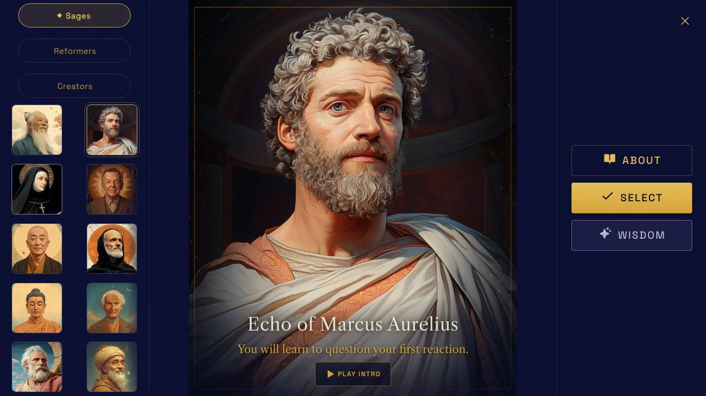

<p align="center">
  
</p>

<h1 align="center">Agora Cosmica</h1>

<p align="center">
  <strong>A Living Library You Can Talk To</strong><br/>
  <sub>Nonprofit · Open Source · No tracking cookies, no profiling</sub>
</p>

<p align="center">
  <a href="LICENSE"></a>
  <a href="https://securityheaders.com/?q=https%3A%2F%2Fagoracosmica.org&followRedirects=on"></a>
  <a href="docs/SELF-HOSTING.md"></a>
</p>

<p align="center">
  <a href="https://agoracosmica.org">Open the library</a> ·
  <a href="docs/TOUR.md">Tour</a> ·
  <a href="#run-it-yourself">Quick start</a> ·
  <a href="docs/SELF-HOSTING.md">Self-hosting</a> ·
  <a href="CONTRIBUTING.md">Contributing</a> ·
  <a href="CHANGELOG.md">Changelog</a>
</p>

Thirty figures across 2,500 years. Each has twelve narrated chapters of their life, twelve teachings to talk through, and an Echo to talk to, even mid-chapter.

<p align="center">
  <a href="https://agoracosmica.org"></a><br/>
  <sub>Listen to a life. Pause when a question comes up. Hear the Echo answer, then pick up the story.</sub><br/>
  <sub><a href="https://agoracosmica.org">agoracosmica.org</a>: 30 free messages a day, no account, English or German.</sub>
</p>

The figures run from Laozi to Martin Luther King Jr. The voice that answers is an AI Echo, an interpretation grounded in primary works and historical context, and the app labels it as one throughout. A factcheck per figure separates what is documented from what is recreated.

---

## One figure, six formats

Everything orbits one figure at a time. Pick Marcus Aurelius and there are six ways to spend an evening with him. Four chapters build on each other (receive, explore, connect, prove), and two open formats sit beside them.

| Format | What happens | Type |
|---|---|---|
| Story | A chapter of the figure's life, narrated, about 13 minutes, text alongside | Recorded |
| Wisdom | You talk through one teaching with the Echo | Live |
| Prism | The figure works through the same teaching with three other thinkers | Recorded |
| Quest | A Socratic test of what you took from the teaching | Live |
| Free Talk | Open conversation, typed or spoken | Live |
| Council | Four figures on one question: a moderator and three voices, at two depth levels | Recorded |

That is 360 story chapters, 360 teachings, 360 prism dialogues and 110 council recordings on 55 questions in each language. The stories, prisms and councils all come with audio, and the stories alone run 79 hours in English and 86 in German. [See all thirty figures](https://agoracosmica.org/figures) or [browse the audio library](https://agoracosmica.org/audio/).

<details>
<summary>The thirty, roughly in order of birth</summary>

Laozi, Siddhartha Gautama, Plato, Marcus Aurelius, Hildegard von Bingen, Dōgen Zenji, Rumi, Meister Eckhart, Leonardo da Vinci, Galileo Galilei, William Shakespeare, Johann Wolfgang von Goethe, Wolfgang Amadeus Mozart, William Blake, Jane Austen, Arthur Schopenhauer, Ada Lovelace, Harriet Tubman, Emily Dickinson, Friedrich Nietzsche, Mohandas Gandhi, Carl Gustav Jung, Albert Einstein, Virginia Woolf, Joseph Campbell, Frida Kahlo, Simone de Beauvoir, Nelson Mandela, Maya Angelou, Martin Luther King Jr.

</details>

Hear the live Echo voices, Qwen3-TTS on our own speech servers:

| English | German |
|---|---|
| [Shakespeare's Echo voice](.github/assets/audio/echo-shakespeare-en.mp3) | [Nietzsche's Echo voice](.github/assets/audio/echo-nietzsche-de.mp3) |
| [Ada Lovelace's Echo voice](.github/assets/audio/echo-lovelace-en.mp3) | [Hildegard von Bingen's Echo voice](.github/assets/audio/echo-hildegard-de.mp3) |

---

## Ask while you listen

Pause a chapter and one line appears under the player: ask him something. Type it or say it. The answer comes back in the same Echo voice, built from what you have heard so far, and the chapter picks up a breath before the second you stopped it. If the exchange is going somewhere, carry it on as Free Talk.

<p align="center">
  <br/>
  <sub>Pause a chapter, ask the figure, hear the Echo answer, and the chapter picks up where it stopped.</sub>
</p>

New in [1.3.0](CHANGELOG.md), along with an English voice engine choice: Qwen3-TTS or Kokoro, five voices per gender each.

---

## What's documented, what's recreated

<p align="center">
  <br/>
  <sub>For every chapter: what the record supports, what was written for the story, and the sources one tap away.</sub>
</p>

Every figure is an AI Echo, and the app says so where it counts: on the welcome screen, in the name on every figure, and in the `X-AI-Generated` header on every API response. [Why we call them Echoes](docs/WHY-ECHOES.md) takes the hardest question about the project seriously: whether it is right to put words in the mouths of people who cannot consent.

The browser screens what you type, and the edge screens it again before it reaches a model. Self-harm screening runs in tiers: if someone writes about their own distress, the turn stops and crisis resources appear, while a question about the Stoics or Virginia Woolf gets an answer. Jailbreak patterns are blocked, and you get a warning before you send an email address or a phone number. [Content safety](docs/CONTENT-SAFETY.md) lists the layers, and [the crisis protocol](docs/CRISIS-PROTOCOL.md) says what triggers what.

The interface targets WCAG 2.2 AA: keyboard paths, screen reader labels, 44 px touch targets. The touch-target check runs in development, with no CI gate for it yet. [Accessibility](docs/ACCESSIBILITY.md) has the rest.

---

## What the code does with your data

You enter with one click on a consent screen (16 or older, and the terms). There is no account. Conversation history, your profile and any API key you add live in IndexedDB in your browser, encrypted at rest with AES-256-GCM. The API key sits under a device key the browser marks non-extractable: a script on the page can use it and cannot read it out. [The threat model](docs/THREAT-MODEL.md) says what that protects against and what it does not.

The free tier is 30 messages a day per device. They pass through a Cloudflare Worker to DeepSeek V4 Pro at Nebius in the United Kingdom, with Qwen3-235B in Finland as the fallback when the day's shared budget is spent, the primary errors, or the first token takes longer than five seconds. Each reply names the model that answered. Every free reply costs us money at a provider, which is why the day has a budget behind it. The worker keeps no per-request log. With your own OpenRouter key, requests go from your browser to OpenRouter directly, pinned to one model with zero data retention on by default, and the key never reaches us.

Live speech runs on Qwen3-TTS for English and German on our own GPU servers in Germany, with faster-whisper for speech-to-text. The recorded catalog is served from Cloudflare R2 in Western Europe.

What we count is aggregate, with no user dimension and no key that joins two rows. The only cookies on the site are Cloudflare's bot-detection ones. One exception, named up front: visitors from our free nonprofit Google Ad Grants ads carry a click id, and if they opt in (off by default, revocable in Settings) the worker forwards it to Google Ads at a conversion step. It never enters our own counters. [What we measure](docs/MEASUREMENT.md) lists every counter, [Security architecture](docs/SECURITY-ARCHITECTURE.md) the data flows and subprocessors, [Compliance](docs/COMPLIANCE.md) the GDPR, EU AI Act Article 50 and youth protection (JMStV, 16+) posture. All of it is checkable against the code in this repository, which is the reason the code is public.

<p align="center">
  
</p>

<details>
<summary>Every route, and every limit</summary>

| Your setup | Where the request goes |
|---|---|
| Hosted free tier | Browser, through our Cloudflare Worker, to Nebius: DeepSeek V4 Pro in the United Kingdom, Qwen3-235B in Finland as the fallback |
| Your own OpenRouter key | Browser directly to OpenRouter, pinned to Qwen3 235B, zero data retention on by default, our worker outside the path |
| Local Mode | An OpenAI-compatible endpoint you run, set in Settings, with local speech set up separately |

| Limit | Allowance |
|---|---|
| Chat, per device identity | 30 messages a day |
| Chat, per hashed address | 300 requests a day |
| Chat, shared across everyone | 15,000 requests a day |
| Custom councils and conversation summaries, per identity | 1 and 2 a day |
| Session tokens, per address | 120 an hour, each valid for ten minutes |

The fallback model answers in three cases: the day's inference budget is spent, the primary model errors, or the first token has not arrived after five seconds. The budget counts real provider token usage and rolls over at midnight in Berlin. Every number here is in [`workers/llm-proxy/src/config.ts`](workers/llm-proxy/src/config.ts).

</details>

---

## Run it yourself

```bash
git clone https://github.com/chipmates/agoracosmica.git
cd agoracosmica/client
pnpm install && pnpm setup:assets && pnpm dev
```

**Node.js 22 and pnpm 8.15.5**, both pinned. The app comes up on [localhost:5173](http://localhost:5173). The content (stories, prisms, factchecks, voice profiles) is fetched from the production CDN at setup and stays out of the repository under the content licence below. [CONTRIBUTING.md](CONTRIBUTING.md) has the rest of the setup and the pre-PR checks.

```bash
git clone https://github.com/chipmates/agoracosmica.git
cd agoracosmica
docker compose up -d
```

The app on port 8080, with Kokoro for English speech and Whisper for transcription beside it. `--profile nvidia` adds Qwen3-TTS for German, and a script does the same natively on Apple Silicon. Chat needs your own OpenRouter key or a local model: point Local Mode at any OpenAI-compatible endpoint you run (LM Studio, Ollama, vLLM, llama.cpp) and the conversation stays on your machine. Two limits before you start: self-hosted English speech is Kokoro only, since there is no English Qwen3-TTS image yet, and **the browser still fetches the catalog from our CDN unless you mirror it.** [Self-hosting guide](docs/SELF-HOSTING.md).

---

## Where to start

Never used it: [agoracosmica.org](https://agoracosmica.org). Nothing to install.

Checking the claims: every free-tier number above is in `workers/llm-proxy/src/config.ts`, [the security architecture](docs/SECURITY-ARCHITECTURE.md) maps every data flow, and this is the code that runs in production.

Helping: the [good first issues](https://github.com/chipmates/agoracosmica/labels/good%20first%20issue) are open, around accessible names and unit tests. Translators want `ui-en.json` and its German twin in `client/src/assets/translations/`, and a change to one lands in both. A historian who finds an error in a factcheck can open an issue with the source. Teachers who want a chapter and its factcheck in class can write to us with the intended use, since the content needs permission to redistribute until it moves to CC-BY. Questions go in [Discussions](https://github.com/chipmates/agoracosmica/discussions). Inside the app, a Community panel already counts voting power from the teachings you complete, and voting itself opens later.

[Contributing guide](CONTRIBUTING.md) · [Code of conduct](CODE_OF_CONDUCT.md) · [Security policy](SECURITY.md), for vulnerabilities

---

## Who runs it

ChipMates gemeinnützige GmbH, a registered German nonprofit: a limited company bound to a charitable purpose under German tax law, with one project, this one. When we oversimplify a figure or misread a source, write to [agoracosmica@chipmates.ai](mailto:agoracosmica@chipmates.ai).

Code is [AGPL-3.0](LICENSE). Copyleft applies to network deployments. Content (stories, prism dialogues, council debates, factchecks, voice profiles, instruction prompts, images, audio) is copyright ChipMates gemeinnützige GmbH at launch and moves to CC-BY 4.0 within 6 to 12 months of the May 2026 launch. [CONTENT-LICENSE.md](CONTENT-LICENSE.md) has the terms and the attribution format.
