# A tour through Agora Cosmica

Each interaction in Agora Cosmica orbits one figure. The four educational chapters (Story, Wisdom, Prism, Quest) form a learning arc informed by education research (Kolb's experiential cycle, Bloom's taxonomy, retrieval practice): receive, explore, connect, prove. Each chapter prepares the next. Free Talk and Council sit alongside the chapters as open-ended formats.

Here is what it feels like to use the Library.

## Step into the Library

  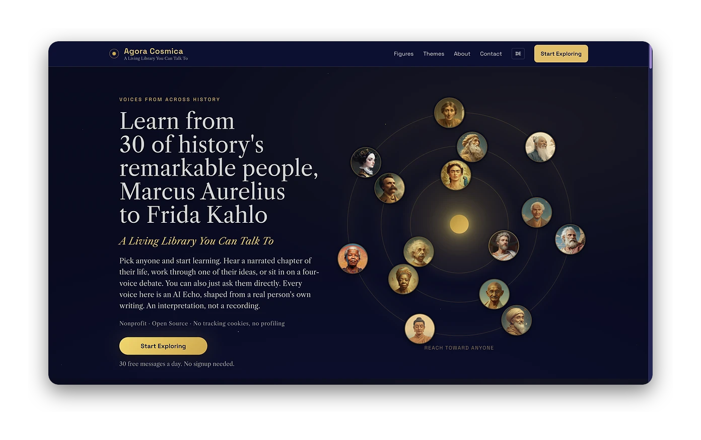 
  <em>Learn from 30 remarkable people across 2,500 years. No signup, 30 free messages a day.</em>

  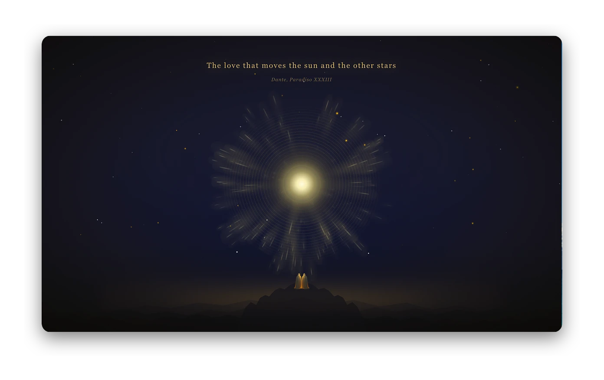 
  <em>A cosmic welcome opens the Library.</em>

## Meet your guide

  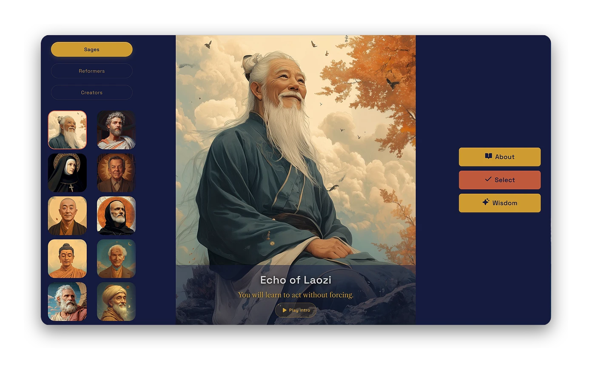 
  <em>Choose a guide. Each figure has a researched voice and twelve wisdom teachings.</em>

## Learn

  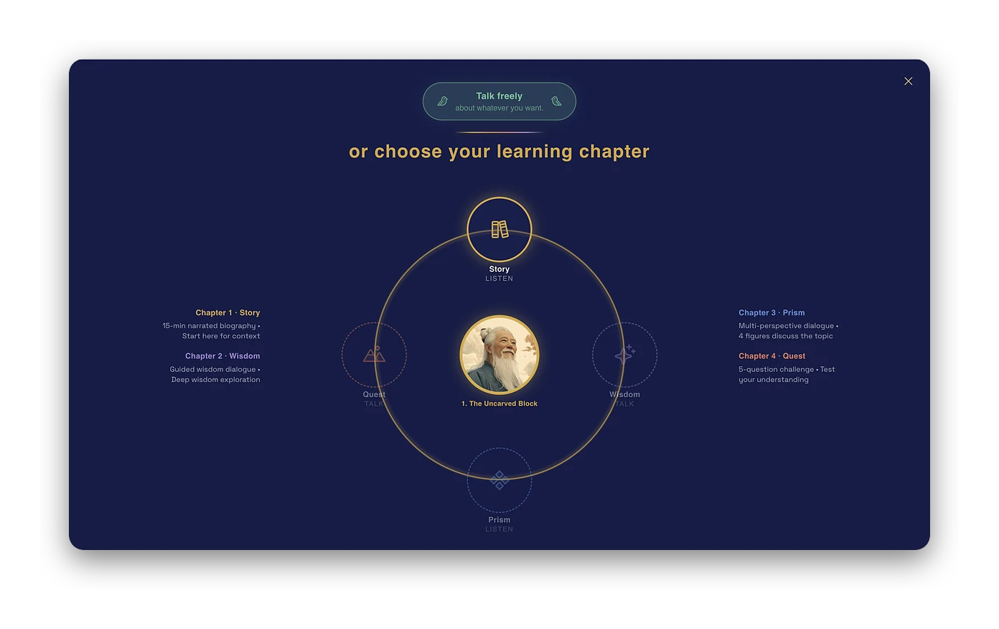 
  <em>Pick a learning chapter, Story, Wisdom, Prism, or Quest, or just talk freely.</em>

  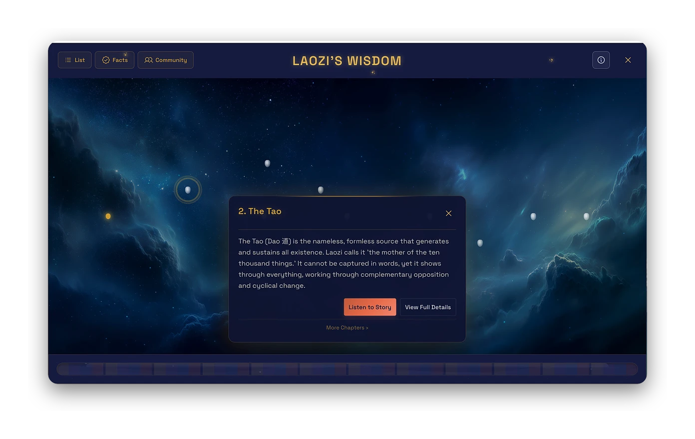 
  <em>Explore a figure's wisdom as a constellation of teachings.</em>

  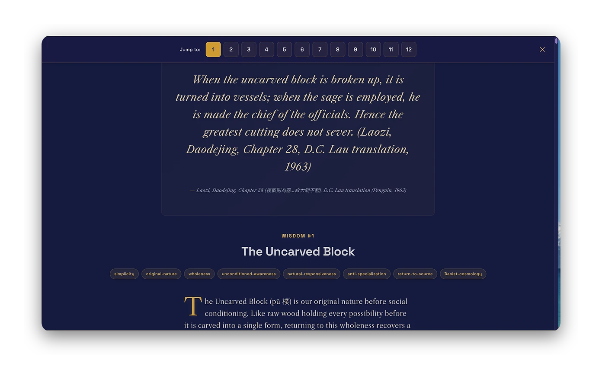 
  <em>Open a teaching with its sourced quote.</em>

## Listen

  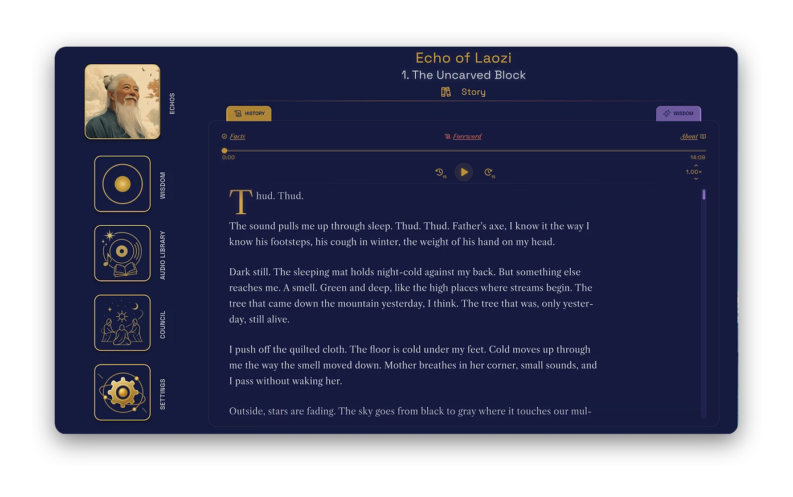 
  <em>Listen to a narrated chapter. Pre-recorded, factchecked, and read aloud, with the text alongside.</em>

  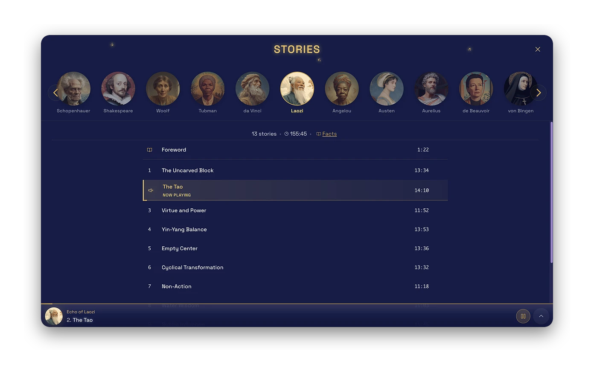 
  <em>A whole library per figure: thirteen chapters, around two and a half hours.</em>

## Talk and convene

  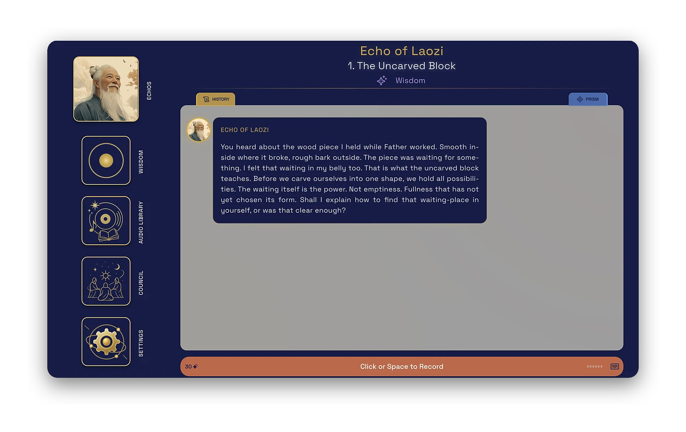 
  <em>Ask anything, in text or your own voice.</em>

  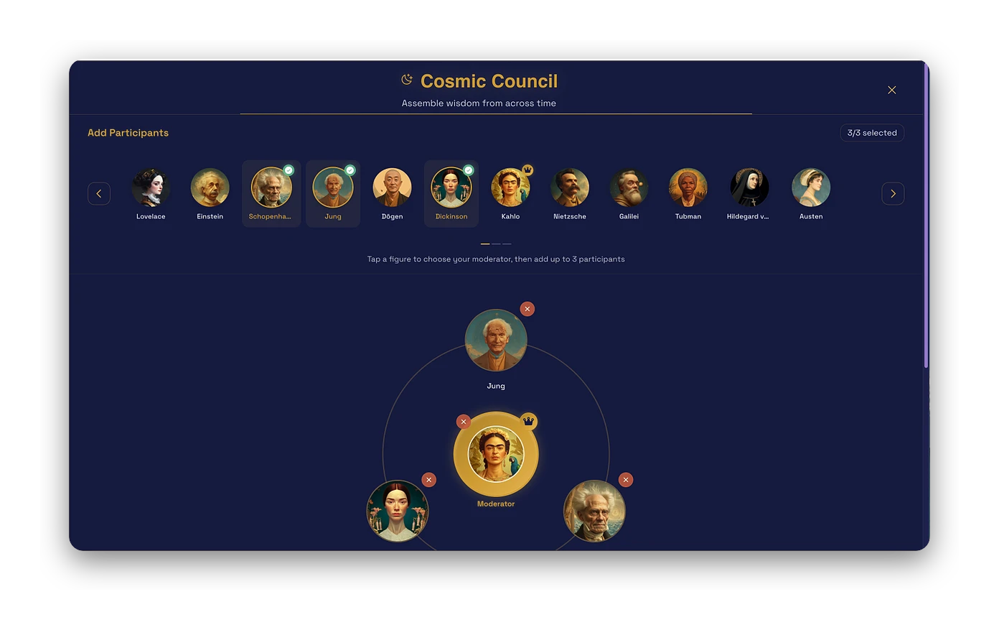 
  <em>Assemble a council of up to four figures from across the centuries.</em>

  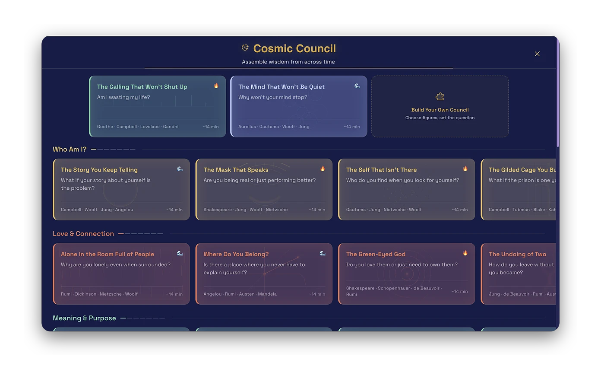 
  <em>Or take one of life's questions to them.</em>

## See the receipts

  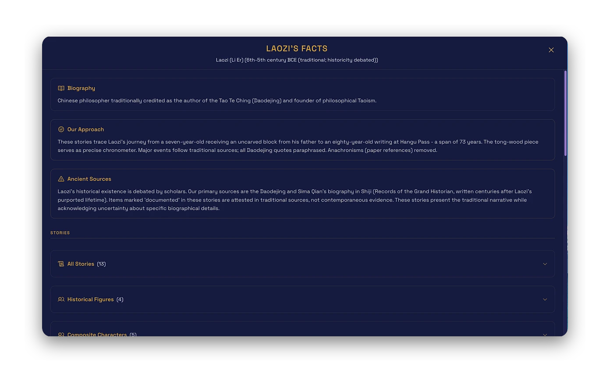 
  <em>Every figure shows what is documented and what is recreated, with its sources.</em>

---

Ready to try it? **[Open the Library →](https://agoracosmica.org)**

For the technical detail of how each chapter works, see [CHAPTERS.md](CHAPTERS.md).
