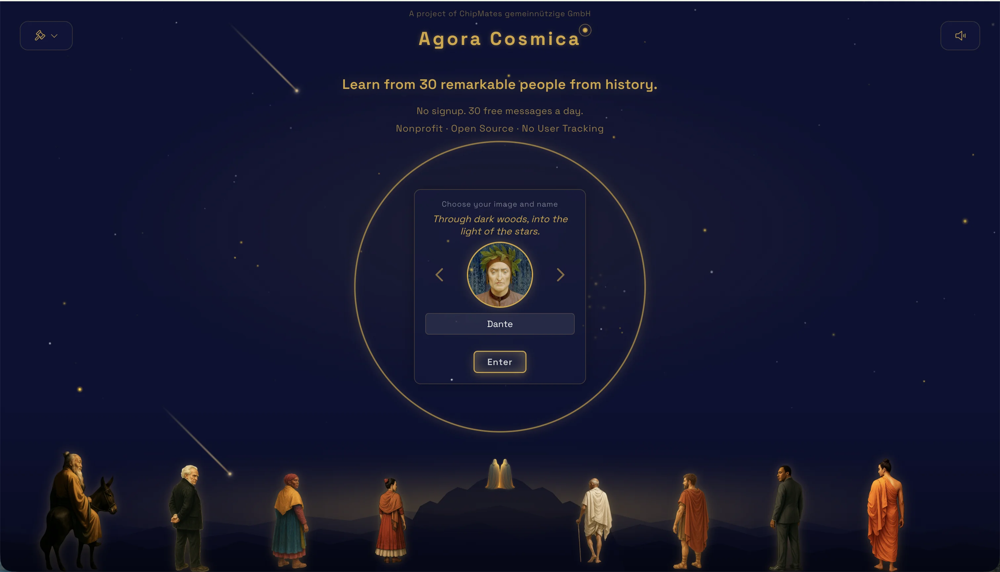
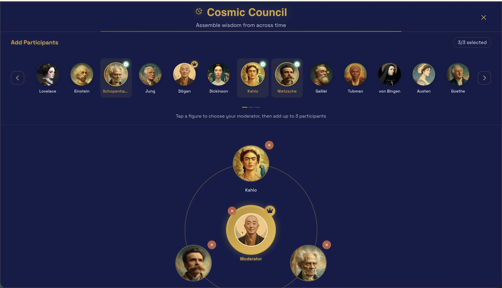

# A tour through Agora Cosmica

Each interaction in Agora Cosmica orbits one figure. The four educational chapters (Story, Wisdom, Prism, Quest) form a learning arc informed by education research (Kolb's experiential cycle, Bloom's taxonomy, retrieval practice): receive, explore, connect, prove. Each chapter prepares the next. Free Talk and Council sit alongside the chapters as open-ended formats.

Step through what it feels like to use the Library.

   
  <em>1. Step into the Library · choose a name and begin</em>

   
  <em>2. Choose your figure · 30 minds across 2,500 years</em>

   
  <em>3. Open one of their twelve teachings</em>

   
  <em>4. Pick a learning chapter, or just talk freely</em>

   
  <em>5. Listen to a Story · pre-recorded, factchecked, narrated</em>

   
  <em>6. Speak in your own voice when you're ready</em>

   
  <em>7. Or join a Cosmic Council on one of life's questions</em>

   
  <em>8. Or assemble your own circle of four</em>

---

Ready to try it? **[Open the Library →](https://agoracosmica.org)**

For the technical detail of how each chapter works, see [CHAPTERS.md](CHAPTERS.md).
