# A tour through Agora Cosmica

Everything orbits one figure at a time. Four chapters build on each other (Story, Wisdom, Prism, Quest: receive, explore, connect, prove), and two open formats sit beside them, Free Talk and Council. Here is what it looks like to use the Library, frame by frame, as of September 2026.

## Step in

  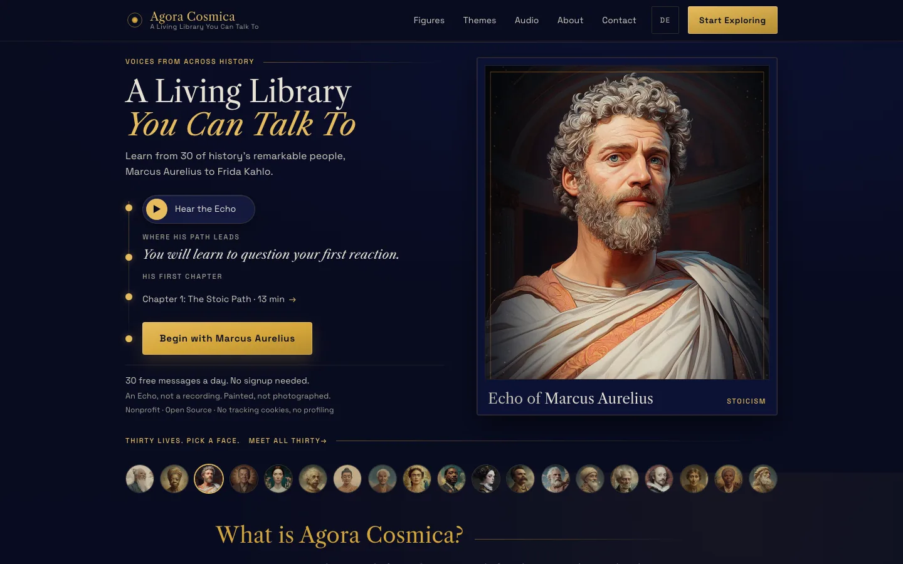 
  <em>The homepage leads with one figure and one door: where his path leads, his first chapter, and a Begin button. 30 free messages a day, no account.</em>

  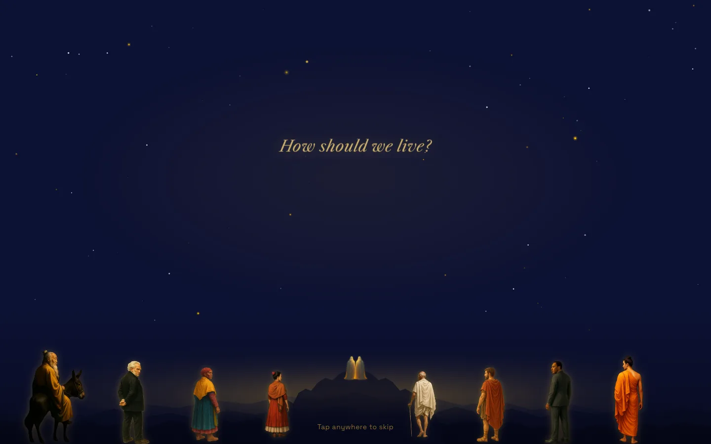 
  <em>A short cinematic opens the Library. Tap anywhere to skip it.</em>

## Meet the figure

  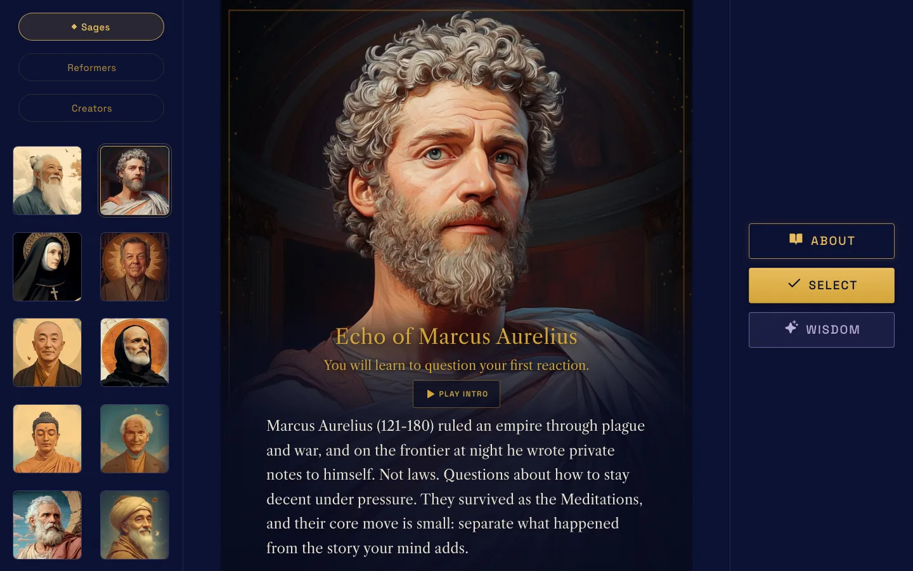 
  <em>Every figure opens with who they were and what you will learn from them. The voice is an AI Echo, grounded in primary works and historical context, and says so.</em>

## Choose a chapter

  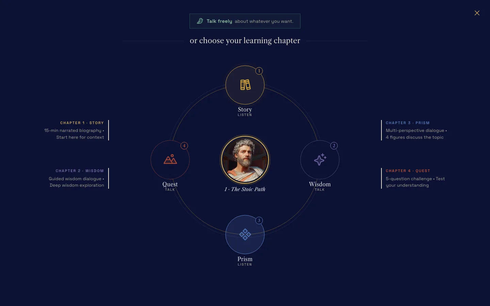 
  <em>The four chapters around one figure, numbered in their order, with Free Talk above them. Council lives in the left nav, since it brings four figures together.</em>

## Listen

  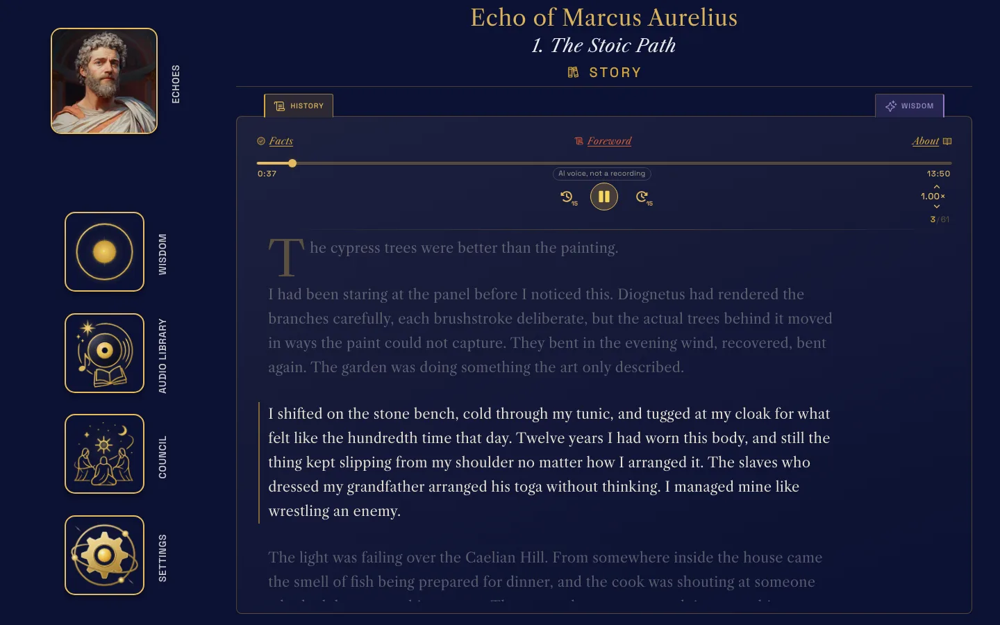 
  <em>A narrated chapter of the figure's life, about 13 minutes, with the text alongside and the spoken paragraph lit as it plays.</em>

  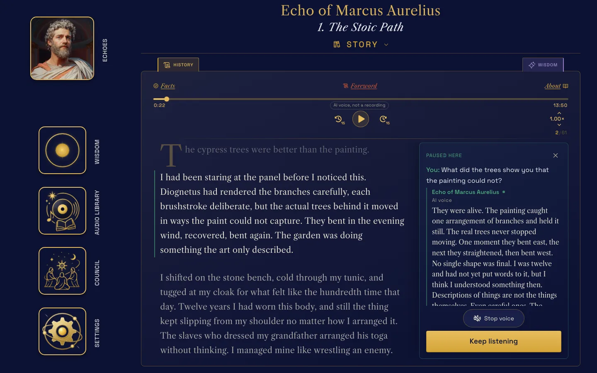 
  <em>Pause a chapter and ask. Type it or say it. The Echo answers from what you have heard so far, and the chapter picks up a breath before where you stopped.</em>

  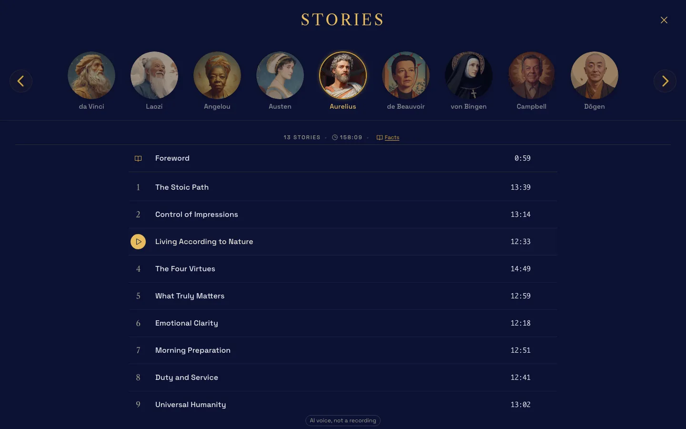 
  <em>The audio library: every figure's foreword and twelve chapters with their lengths, around two and a half hours per figure.</em>

## Talk

  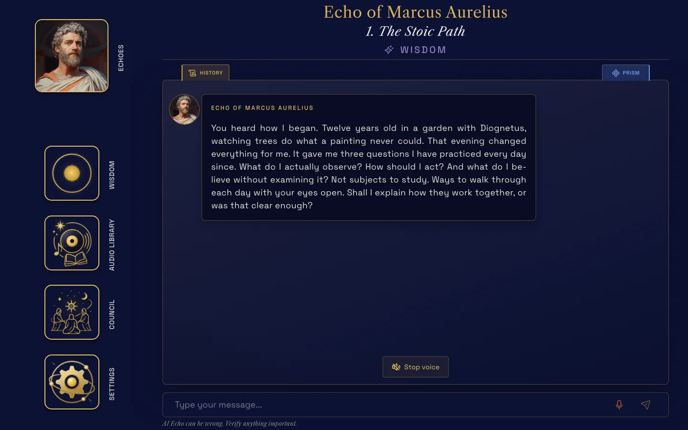 
  <em>A Wisdom conversation on one teaching. Type or speak, and the reply comes in the Echo voice. The note under the field says it plainly: an AI Echo can be wrong, verify anything important.</em>

## Convene a council

  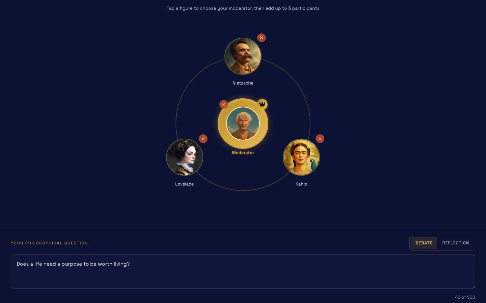 
  <em>Build your own council: a moderator, up to three participants, your question, debate or reflection.</em>

  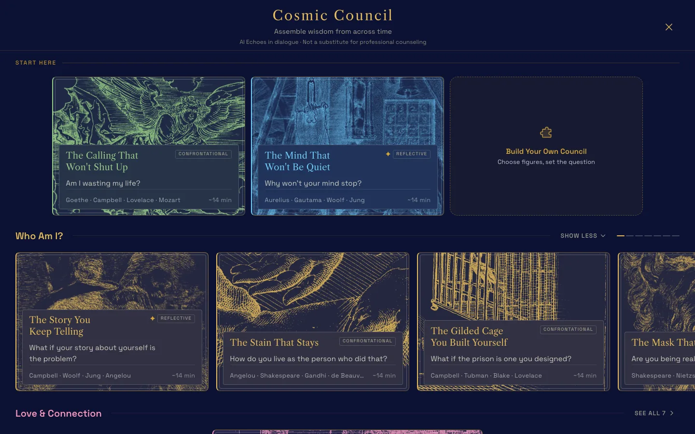 
  <em>Or take one of the recorded councils: 55 questions, four voices each, at two depth levels, on a wall of engraving plates.</em>

## See the receipts

  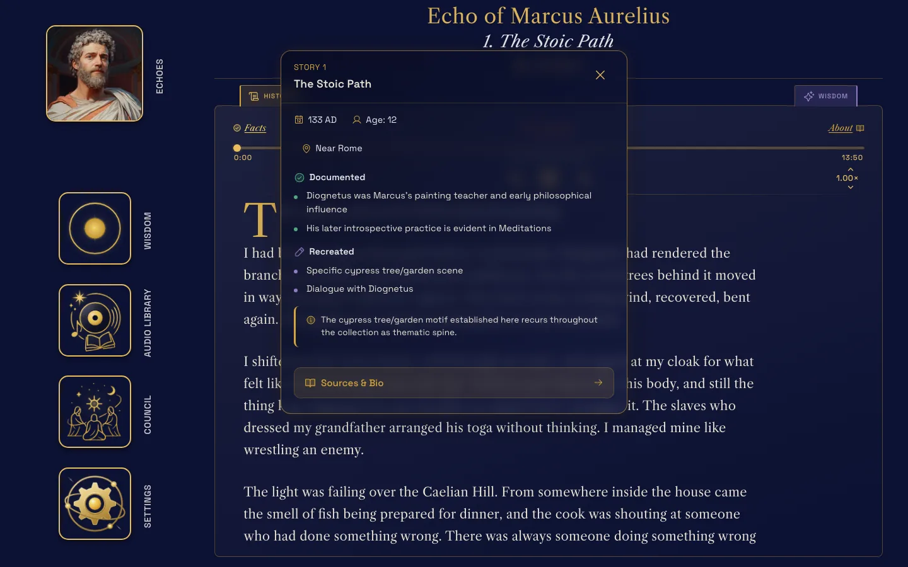 
  <em>Every chapter carries its facts: what the record supports, what was written for the story, and the sources one tap away.</em>

## Choose a voice

  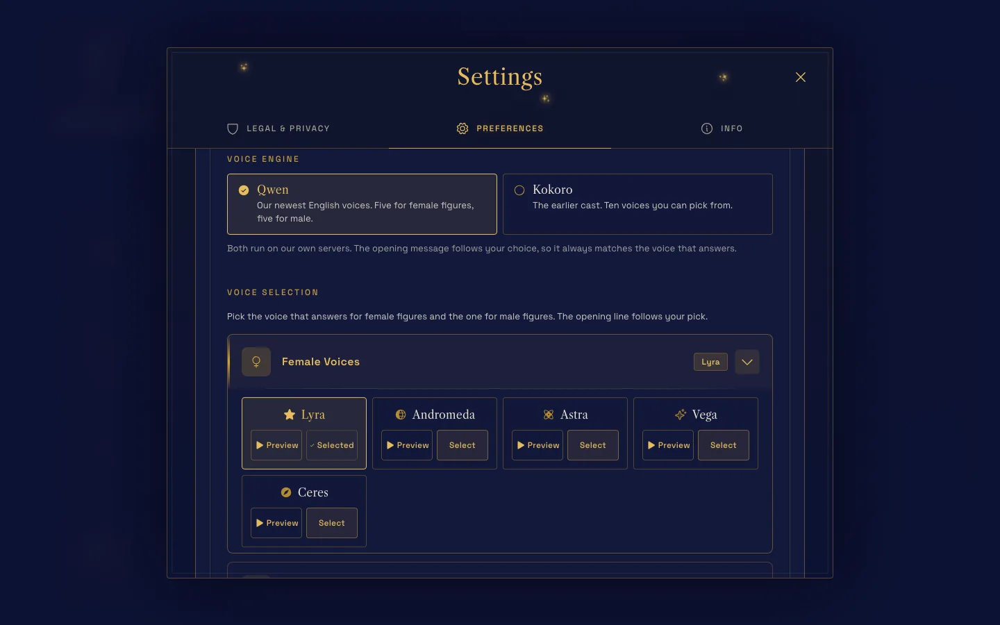 
  <em>English speech runs on Qwen3-TTS by default with five voices per gender, and Kokoro stays selectable. Both run on our own servers.</em>

## On a phone

<table align="center">
  <tr>
    <td align="center" width="50%">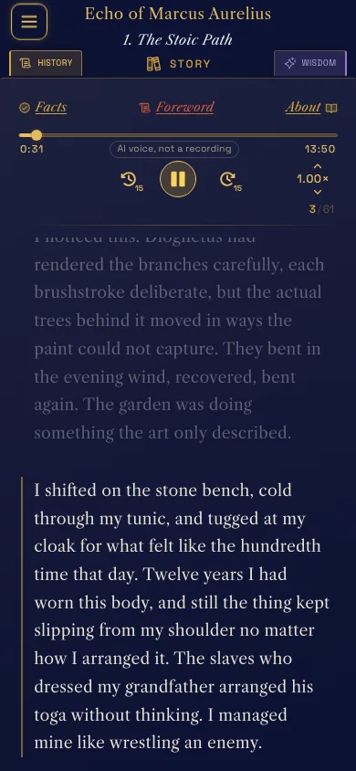</td>
    <td align="center" width="50%">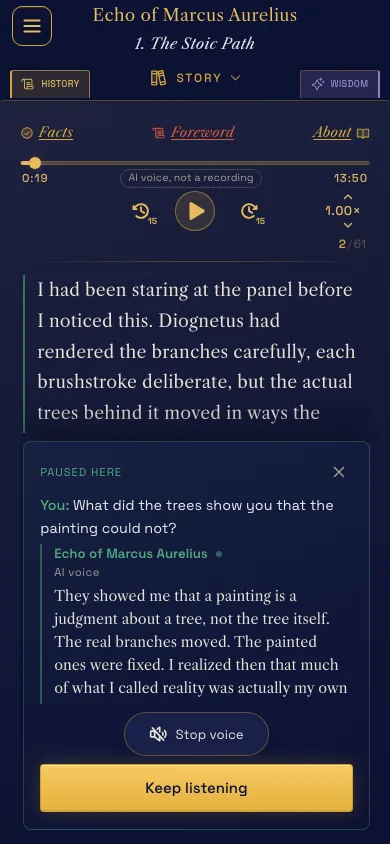</td>
  </tr>
  <tr>
    <td align="center"><em>The same chapter on a phone.</em></td>
    <td align="center"><em>Asking along the way on a phone.</em></td>
  </tr>
</table>

---

Ready to try it? **[Open the Library](https://agoracosmica.org)**

How each chapter works in detail: [CHAPTERS.md](CHAPTERS.md).
